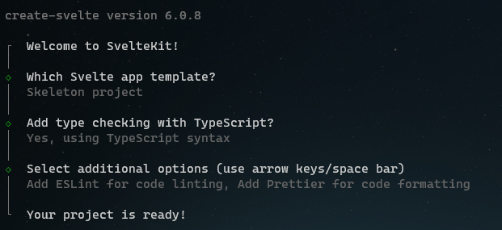
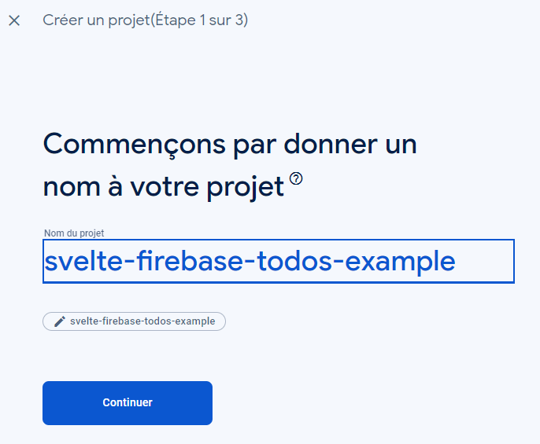
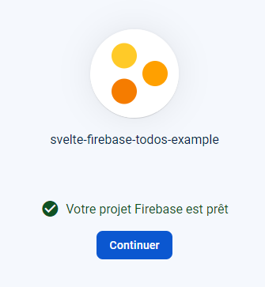
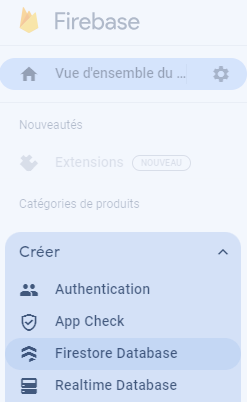
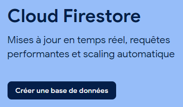
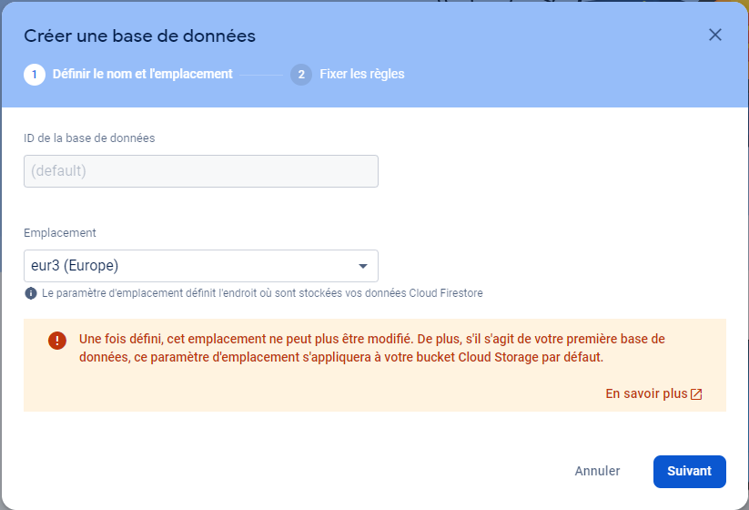
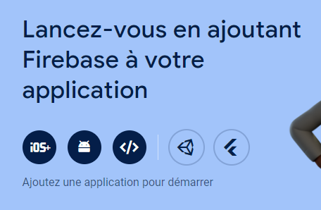
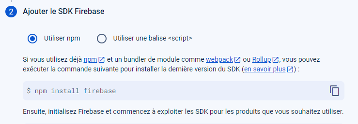
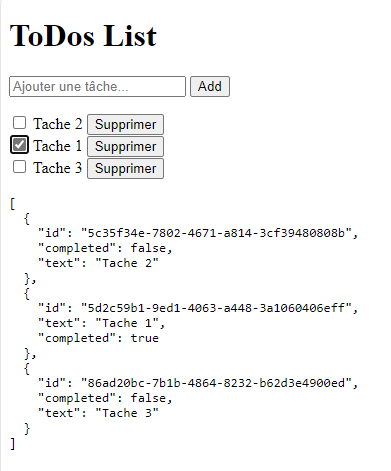

# svelte-firebase-todos-example

Ce projet est un exemple de gestion de tâches réalisé avec Svelte et Firebase.
En aucun cas l'auteur ne garantit la sécurité de ce code, il est fourni à titre d'exemple.

## Introduction

Ce projet à pour but de vous aider à monter une petite application svelte branchée sur une base de données Firebase.
Nous allons voir ensemble comment partir de zéro pour arriver à une application fonctionnelle.
Il s'agit d'un simple CRUD.

Vous pouvez aussi simplement cloner ce projet et l'utiliser comme base pour votre propre application.
Il vous suffira de changer les identifiants de votre base de données Firebase dans le fichier `.env`.

## Création d'une application svelte

Pour commencer, nous allons créer un nouveau projet svelte.
Je passe par npm pour créer mon projet, mais vous pouvez aussi utiliser yarn.
Tout est documenté sur le site de svelte : https://kit.svelte.dev/docs/creating-a-project

```bash
npm create svelte@latest svelte-firebase-todos-example
cd svelte-firebase-todos-example
npm install
```

J'ai choisi de créer mon projet avec les options : 
- Skeleton : SvelteKit
- Language : TypeScript
- ESLint et Prettier



## Installation de Firebase

Nous aurons besoin d'installer le package `firebase` pour pouvoir communiquer avec notre base de données.

```bash
npm install firebase
```

## BONUS de configuration des alias

Afin d'avoir des imports plus "propres" à mon sens, j'aime créer des alias pour mes répertoires, exemple avec mon repertoire `lib`.

Pour cela je configure mon fichier `svelte.config.js` comme ceci :

```javascript
import adapter from '@sveltejs/adapter-auto';
import { vitePreprocess } from '@sveltejs/vite-plugin-svelte';
import { resolve } from 'path';

/** @type {import('@sveltejs/kit').Config} */
const config = {
	preprocess: vitePreprocess(),

	kit: {
		adapter: adapter(),
		alias: {
			$components: resolve('./src/components'),
			$data: resolve('./src/data'),
            $lib: resolve('./src/lib'),
			$models: resolve('./src/models'),
			$stores: resolve('./src/stores')
		}
	}
};

export default config;
```

Je configure également mon fichier `tsconfig.json` pour que les alias soient pris en compte :

```json
{
	"extends": "./.svelte-kit/tsconfig.json",
	"compilerOptions": {
		"allowJs": true,
		"checkJs": true,
		"esModuleInterop": true,
		"forceConsistentCasingInFileNames": true,
		"resolveJsonModule": true,
		"skipLibCheck": true,
		"sourceMap": true,
		"strict": true,
		"moduleResolution": "bundler",
		"paths": {
			"$lib":["./src/lib"],   
			"$lib/*":["./src/lib/*"],
			"$components":["./src/components"],   
			"$components/*": ["./src/components/*"],
			"$stores":["./src/stores"],   
			"$stores/*": ["./src/stores/*"],
			"$models":["./src/models"],   
			"$models/*": ["./src/models/*"],
		}
	},
	"include": ["src/**/*", "src/node_modules/**/*"],
	"exclude": ["node_modules/*", "static/*"]
}

```

## Configuration de Firebase

Je vais maintenant configurer mon projet côté firebase.

Je vais dans la console firebase : https://console.firebase.google.com/
Je crée un nouveau projet:



Je desactive Google Analytics pour cet exemple.


Je créé le projet.



Dans mon projet je vais créer une Firestore Database.







Je choisi le mode `"Démarrer en mode de production"` pour cet exemple.

ATTENTION : Pour cet exemple, je vais autoriser l'accès à ma base de données à tout le monde, mais en production, il faudra bien sûr restreindre l'accès à votre base de données.

Pour cela dans les règles de sécurité de votre base de données, vous pouvez mettre :

```json 
rules_version = '2';

service cloud.firestore {
  match /databases/{database}/documents {
    match /{document=**} {
      allow read, write: if true;
    }
  }
}
```

Maintenant dans la "vue d'ensemble" de mon projet, je vais cliquer sur "Ajouter une application" pour ajouter une application web.



Je la nome `svelte-firebase-todos-example` et je clique sur "Enregistrer l'application".

Cela vous donne accès à votre configuration firebase.




## Initialisation de Firebase dans notre application

Pour des raisons de sécurité, je vais créer un fichier `.env` à la racine de mon projet et y mettre mes variables de configuration firebase. Je remplace les valeurs fournis par firebase par mes variables, j'utilise le préfixe `VITE_` pour que vite prenne en compte mes variables d'environnement.

```env
// dans le fichier.env

VITE_FIREBASE_API_KEY=VOTRE_API_KEY
VITE_FIREBASE_AUTH_DOMAIN=VOTRE_AUTH_DOMAIN
VITE_FIREBASE_PROJECT_ID=VOTRE_PROJECT_ID
VITE_FIREBASE_STORAGE_BUCKET=VOTRE_STORAGE_BUCKET
VITE_FIREBASE_MESSAGING_SENDER_ID=VOTRE_MESSAGING_SENDER_ID
VITE_FIREBASE_APP_ID=VOTRE_APP_ID
```

Je créer un fichier `firebase.ts` dans mon répertoire `lib` pour initialiser ma connexion à firebase et y mettre  la configuration fournie par la console firebase.

```typescript
// dans le fichier firebase.ts

// Import the functions you need from the SDKs you need
import { deleteApp, getApp, getApps, initializeApp } from 'firebase/app';
import { getFirestore } from 'firebase/firestore';

// Your web app's Firebase configuration
const firebaseConfig = {
	apiKey: import.meta.env.VITE_FIREBASE_API_KEY,
	authDomain: import.meta.env.VITE_FIREBASE_AUTH_DOMAIN,
	projectId: import.meta.env.VITE_PROJECT_ID,
	storageBucket: import.meta.env.VITE_STORAGE_BUCKET,
	messagingSenderId: import.meta.env.VITE_MESSAGING_SENDER_ID,
	appId: import.meta.env.VITE_APP_ID
};

// Initialize Firebase
let firebaseApp;
if (!getApps().length) {
	firebaseApp = initializeApp(firebaseConfig);
} else {
	firebaseApp = getApp();
	deleteApp(firebaseApp);
	firebaseApp = initializeApp(firebaseConfig);
}

export const db = getFirestore(firebaseApp);
```

## Création de notre store pour gérer les Todos

Je vais créer un store qui est connecté à firebase pour gérer mes todos.
J'ai besoin de pouvoir en ajouter, en supprimer et en modifier.

```typescript	
// dans le fichier todosStore.ts

import { db } from '$lib/firebase';
import { collection, deleteDoc, doc, getDocs, onSnapshot, setDoc } from 'firebase/firestore';
import { writable } from 'svelte/store'

const todosCollection = collection(db, 'todos');

const createtodosStore = () => {
  const { subscribe, set } = writable([]);

  const fetchtodos = async () => {
    const querySnapshot = await getDocs(todosCollection);
    const todos = querySnapshot.docs.map(doc => ({ id: doc.id, ...doc.data() }));
    set(todos);
  };

  const addtodo = async todo => {
    const id = crypto.randomUUID();
    await setDoc(doc(todosCollection, id), {
        text: todo.text,
        completed: todo.completed,
        id,
      });
  };

  const deletetodo = async id => {
    await deleteDoc(doc(todosCollection, id));
  };

  const unsubscribe = onSnapshot(todosCollection, snapshot => {
    const todos = snapshot.docs.map(doc => ({ id: doc.id, ...doc.data() }));
    set(todos);
  });
  
  const updatetodo = async (todo) => {
    await setDoc(doc(todosCollection, todo.id), todo);
  };

  return {
    subscribe,
    addtodo,
    deletetodo,
    updatetodo,
    set: fetchtodos
  };
};

const todosStore = createtodosStore();
export default todosStore;

```

## Création de notre composant Todo

Je vais créer un composant `todos.svelte` pour gérer mes todos.

```html
// dans le fichier /components/todos.svelte
<script>
    import todosStore from '$stores/todosStore'

    let newtodo = '';

    const addtodo = () => {
        if (newtodo.trim() !== '') {
            todosStore.addtodo({ text: newtodo, completed: false });
            newtodo = '';
        }
    };

    const deletetodo = id => {
        todosStore.deletetodo(id);
    };

    const updatetodo = async (todo) => {
        await todosStore.updatetodo(todo);
    };
</script>
<h1>ToDos List</h1>
<!-- Je créer un simple champ de texte pour ajouter une tâche, et un bouton pour ajouter la tâche à la liste.-->
<input type="text" bind:value={newtodo} placeholder="Ajouter une tâche..." on:keydown={e => e.key === 'Enter' && addtodo()} />
<button on:click={addtodo}>Add</button>

<!-- Ensuite, je crée une liste de tâches avec une case à cocher pour marquer la tâche comme terminée, un bouton pour supprimer la tâche et un bouton pour afficher le JSON de la liste des tâches. -->
<ul>
    {#each $todosStore as todo (todo.id)}
        <li>
            <input type="checkbox" bind:checked={todo.completed} on:change={() => updatetodo(todo)} />
            <span>{todo.text}</span>
            <button on:click={() => deletetodo(todo.id)}>Supprimer</button>
        </li>
    {/each}
</ul>

<!-- BONUS Debug :  J'affiche mon object json récupéré de ma base  -->
<pre id="json">{JSON.stringify($todosStore, undefined, 2)}</pre>

<style>
    ul {
        list-style-type: none;
        padding: 0;
    }
</style>
```

## Utilisation de notre composant Todo

Dans la page `+page.svelte` je vais utiliser mon composant `todos.svelte` pour afficher mes todos.

```html
// dans le fichier /routes/+page.svelte
<script>
    import Todos from '$components/todos.svelte'
</script>

<Todos />
```

## Lancements de notre application

Pour lancer notre application, je vais utiliser la commande `npm run dev`.

```bash
npm run dev
```



## Conclusion

Nous venons de réaliser une simple application permettant de gérer une liste de tâches avec Svelte et Firebase.

Vous n'avez plus qu'à y ajouter votre CSS et votre touche personnelle pour en faire une application qui vous ressemble.

N'hésitez pas à me contacter si vous avez des questions ou des suggestions.

Vous pouvez aussi aller plus loin en ajoutant des fonctionnalités comme l'authentification comme je l'ai fait dans mon exemple complet : (ici so soon)